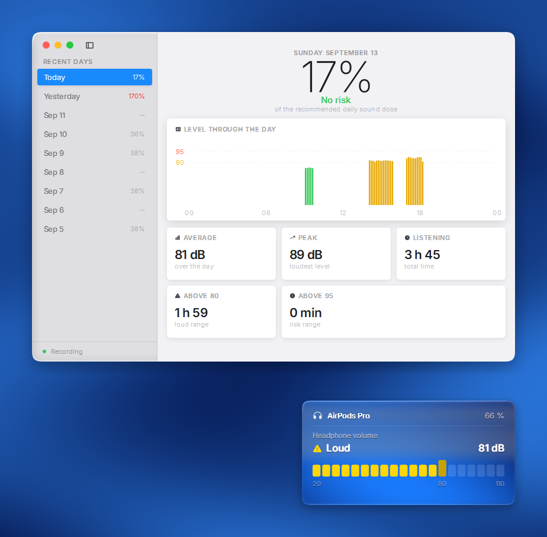

# AirPods Sound Levels

A live headphone loudness meter and daily exposure log for Windows, in the
style of the iOS Control Center headphone module and the Health app's hearing
section.

Windows has no equivalent of iOS's "Headphone Audio Levels" — the number is
not something AirPods transmit, it is computed on the source device. This
reconstructs it: it taps the actual audio stream being sent to your
headphones, A-weights it the way iOS does, adds the volume attenuation, and
applies a per-model loudness reference.



## What it does

- **Tray meter** — the current level in dB(A), coloured by tier, updated live
- **Control Center style panel** — click the tray icon; real Liquid Glass,
  refracting the desktop behind it at ~60 fps
- **Exposure window** — the day's levels, your share of the recommended daily
  dose, and the last nine days, in a light window built like Finder
- **Automatic model detection** — reads the Bluetooth product ID and picks the
  matching loudness reference
- **English and French**, picked from your Windows display language

## Install

Requires **Windows 10 2004 or later** and **Python 3.9+**.

```bash
git clone https://github.com/Shisuboi/airpods-sound-levels.git
cd airpods-sound-levels
pip install -r requirements.txt
python run.py
```

Or double-click `AirPods Sound Levels.bat`.

The app lives in the notification area. Left-click opens the panel,
right-click opens the menu (exposure window, live backdrop toggle, open at
login, quit).

## How accurate is it?

**Treat readings as ±10 dB unless you calibrate.** The chain is:

```
SPL(A) = reference + signal level dBFS(A) + volume attenuation dB
```

The first two terms are measured exactly — the audio stream via WASAPI
loopback, the attenuation via the Windows endpoint API. The **reference** is
the weak link: it is how loud the model plays a full-scale signal at 100 %
volume, and only a few headphones have published coupler measurements. The
rest inherit a family value.

For context, one cross-check against iOS Health on AirPods Pro landed within
4 dB. Apple's own figure is not ground truth either — published comparisons
put it around 7 dB above external measurement equipment.

### Calibrating your own unit

Create `%APPDATA%\AirPodsSoundLevels\calibration.json`:

```json
{ "0x2014": 102.5 }
```

Use your Bluetooth product ID as the key, or `"default"` to override every
device. To find the right number: play a steady tone, read the app's estimate,
measure the real level with an SPL meter app held against the earbud, and
shift the reference by the difference.

## Supported devices

Any Windows audio output works — the meter always runs. Model detection
covers Apple and Beats Bluetooth devices; product IDs come from
[The Apple Wiki](https://theapplewiki.com/wiki/Bluetooth_PIDs). Unknown models
fall back to a family estimate, and non-Apple outputs use the default
reference.

## Exposure maths

Dose follows NIOSH: 85 dB(A) for 8 hours, a 3 dB exchange rate, and nothing
counted below 80 dB(A). Every minute consumes a share of the daily allowance
according to its level, so 88 dB burns it twice as fast as 85, and 91 dB four
times as fast. 100 % is the daily limit.

Levels are stored one row per minute as an energy average, not an arithmetic
one — averaging decibels as plain numbers is meaningless. The database lives
in `%APPDATA%\AirPodsSoundLevels\history.db` so it survives moving or
reinstalling the app.

## Language

Detected from the Windows display language; English unless that is French.
Force it with the `AIRPODS_LEVELS_LANG` environment variable (`en` or `fr`).

## Notes

- The glass panel captures the screen region behind it to refract it. While
  grabbing, the window sets `WDA_EXCLUDEFROMCAPTURE` for a few milliseconds so
  it does not photograph itself; it stays visible to you and to your own
  screenshots the rest of the time.
- On pause, WASAPI stops delivering blocks rather than delivering silence, so
  a reading older than 350 ms counts as silence.
- Bundles [Inter](https://rsms.me/inter/) (SIL OFL 1.1) and
  [Phosphor Icons](https://phosphoricons.com/) (MIT).

## Licence

MIT. See [LICENSE](LICENSE).
